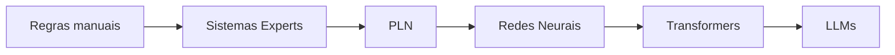
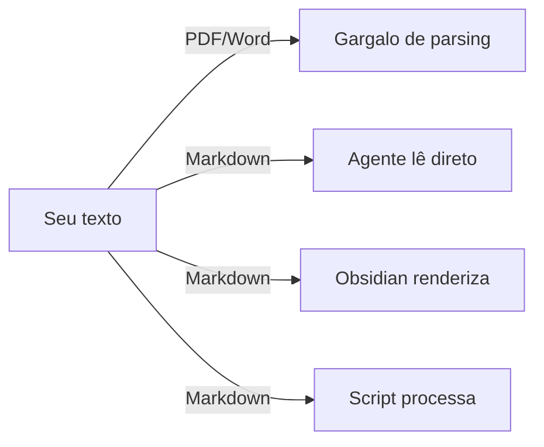
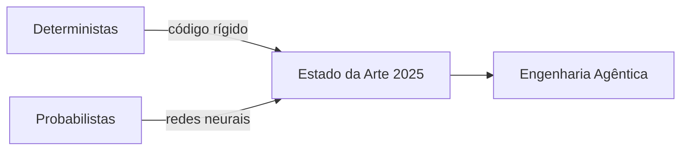
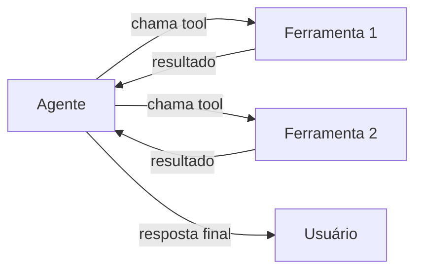
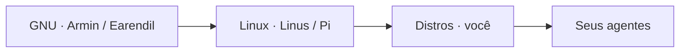
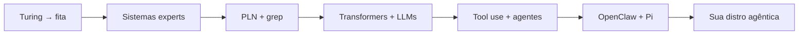
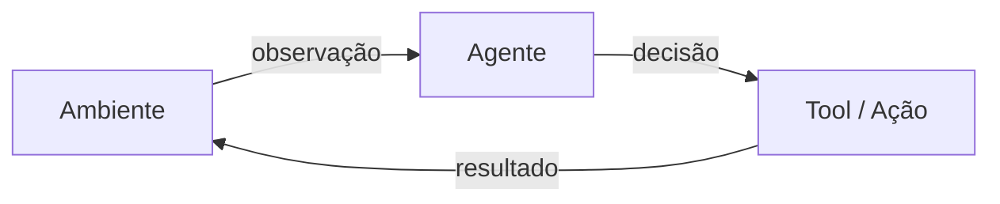
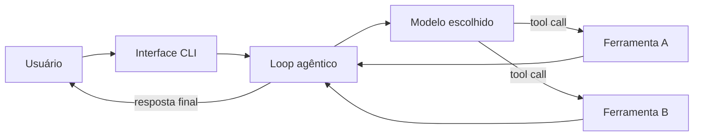

### Engenharia agêntica, open claw e o futuro do software

> Palestra + Workshop — FLISOL 2026 Mossoró
> 1h30min · 45min palestra · 45min workshop

---

#### Quem sou eu

**Arthur Aleksandro Alves Silva**

- Eletrotécnico · IFRN
- Técnico em TI · IMD
- Cientista da Computação · UFERSA
- Especialista em Testes · UFPE
- Engenheiro de Software · SERPRO

> Já completei minhas 10.000 horas na área.

---

#### De Mossoró para o mundo

- Vocês podem me conhecer pelo **"UFERSA Vai de Bike"**
- Moro em Recife há 6 anos
- Saindo da caverna para espalhar a palavra do **software agêntico**

> *"Nunca me envolvi muito no FLISOL — estava com outras coisas na cabeça. Hoje estou aqui para corrigir isso."*

---

### PARTE 1 · O PASSADO

---

#### A história não se repete…

> …mas rima que é uma beleza.

---

#### O Chile que poderia ter sido

- Anos 70: o Chile tentou um sistema digital de coordenação nacional
- Uma sala que parecia uma nave espacial
- Sabotado pelo golpe militar

---

![[cybersin.png]]

---

#### Do Cybersyn à AWS

- O estado da arte em coordenação digital hoje?
- **Empresas privadas**
- Não deixaram a gente evoluir os nossos sistemas

> *Quem são "eles"? Essa palestra não vai resolver isso — mas vai te dar ferramentas para não depender deles.*

---

#### Turing e a fita

- Tudo começa com Turing
- A ideia da fita ainda é presente
- O que é uma sessão de chat com uma IA?

```
┌────┬────┬────┬────┬────┐
│ P  │ R  │ O  │ M  │ PT │  ← você escreve
└────┴────┴────┴────┴────┘
           ↓
        [ LLM ]
           ↓
┌────┬────┬────┬────┬────┐
│ R  │ E  │ S  │ P  │ TA │  ← resposta
└────┴────┴────┴────┴────┘
```

> Continua sendo uma fita.

---

#### O teste de Turing virou piada?

- Muita gente conversa com bot achando que é humano
- E ok, queremos agilidade
- Mas **sem controle**, já era

---

#### Sistemas experts não são novos

- Desde o início da computação
- ELIZA foi uma das primeiras experiências agênticas
- O que mudou: **generalizamos o processamento**

---

![[ELIZA_conversation.png]]

---

#### Da ELIZA até aqui



---

#### O `grep` e a primeira NLP

- Criado para analisar os **Federalist Papers**
- Textos sem assinatura → atribuídos por vícios de linguagem
- Cada fundador tinha manias de escrita detectáveis

> *Se até um fundador dos EUA pode ser "profiled" assim, quem é você na fila do pão?*

---

#### Você tem vícios. Use-os a seu favor

- Aceite seus padrões
- Cultive um **jardim digital**
- Seus vícios de escrita são sua assinatura

> *Se você tem vícios, cultive-os num lugar que seja seu.*

---

### PARTE 2 · O JARDIM DIGITAL

---

#### Plain text is king

```
Markdown → renderiza como HTML, slides, PDF
LaTeX    → artigos científicos renderizáveis
org-mode → scripts + texto misturados
```

> Você não escreve notas em binário. Fique no formato intermediário.

---

#### Por que não PDF, Word, Excel?



---

#### Frontmatter + Markdown

```markdown
---
title: Minha nota
tags: [agente, jardinagem]
date: 2026-04-24
---

# Conteúdo aqui
```

- Sua base de conhecimento vira dados estruturados
- Compatível com qualquer IDE
- Funciona offline, para sempre

---

#### Obsidian e o ecossistema

- Não é só um editor — é uma plataforma
- Comunidade que inclui pesquisadores, engenheiros, escritores

---

![[obsidian_enterprise.png]]

---

##### aretw0/vault-seed — seu ponto de partida

- Repositório template de Obsidian + VSCode pronto para gerar outros repositórios a partir dele.
- Estrutura básica: notas, agenda, projetos em plain text
- Botão "Use this template" no GitHub — zero configuração

> *Cria o solo. Você planta o que quiser.*

`github.com/aretw0/vault-seed`

---

#### Code Literacy

> A habilidade de ler, escrever e entender código como linguagem — não só como ferramenta.

- Seu texto e seus scripts podem se misturar
- org-mode foi precursor disso
- Hoje: qualquer agente pode ser seu co-autor

---

### PARTE 3 · O PRESENTE AGÊNTICO

---

#### O racha histórico



- Codadores vs. cientistas de modelos
- Agora chegaram no estado da arte dos **dois mundos**

---

#### O hardware finalmente chegou

- Faltava poder computacional para guardar os "pesos"
- GPUs tornaram viável treinar e rodar modelos grandes
- A física da inteligência encontrou a regra do menor esforço

> *Ghost in the Shell deixou de ser ficção científica.*

---

#### 2025: a era do catnip

- Modelos ficaram bons em **tool use** — agentes funcionando de verdade
- MCP lançado e com speedrun de adoção
- Ninguém dormia mais experimentando

---

#### Tool use: como o agente age



> O agente decide qual tool chamar e com quais parâmetros.
> Você define as tools. O modelo decide quando usá-las.

---

#### MCP — quando faz sentido

- MCP é um protocolo para **expor ferramentas via servidor**
- Speedrun de adoção: IDEs, agentes e ferramentas adotaram em meses
- Útil em produção: vários clientes compartilhando as mesmas tools

> *Tool use direto resolve a maioria dos casos — MCP vale quando você precisa escalar ou compartilhar.*

---

#### O momento Richard Stallman

- Stallman percebeu que ficaria preso a uma impressora defeituosa
- Conclusão: **precisamos de software livre**
- Em 2025, alguns perceberam o mesmo com os agentes de código

> *A gente precisa de um kernel. A gente precisa de um motor.*

---

#### Três pessoas que chegaram lá

| Pessoa | Referência | Papel |
|--------|-----------|-------|
| **Pete** | steipete.me | O explorador — foi para a OpenAI |
| **Armin** | criador do Flask | O cientista — fundou a Earendil |
| **Mario** | mariozechner.at | O arquiteto — criou o Pi |

---

#### OpenClaw

- Mais estrelas que o kernel do Linux
- Não é só assistente pessoal
- É um **framework de agentes**
- O presidente da NVIDIA não estava fazendo hype

---

![[openclaw.png]]

---

#### O Pi — um kernel minimalista

- Mario olhou para o caos de opções e criou algo **pequeno e extensível**
- Não é a LLM — você **carrega** uma LLM nele
- Extensível sem te prender a ele
- **Sem MCP de fábrica** — tool direto é a filosofia; MCP quando realmente precisar

> *É o que se chama de agent harness — mas construível.*

---

![[pi.png]]

---

#### Earendil = GNU · Pi = Linux



- A Earendil é o projeto de fundação (filosofia, ferramentas)
- O Pi é o primeiro kernel funcional
- Cada um pode ter a sua **distro agêntica**

---

#### O futuro está nos trilhos

> As regras do bom software **não mudaram**.
> O que mudou foi a velocidade e a facilidade de prototipagem.

- Clean code ✓
- Design patterns ✓
- Arquitetura de software ✓

---

#### Psicose agêntica é real

- Gente achando que o modelo vai resolver tudo
- Você a um prompt de um app que "vai mudar o mundo"
- Se demorar para dominar as ferramentas, vai ficar no nível de **usuário da plataforma dos outros**

> Se vai ser usuário, que seja de uma que você ajudou a construir.

---

#### Resumo da palestra



---

#### Por onde começar

1. **Jardinagem digital** — second brain, Zettelkasten
2. **Plain text** — Markdown, frontmatter, Obsidian
3. **Instalar o Pi** — e entender o loop agêntico
4. **Explorar o ecossistema** — `pi.dev/packages`
5. **Contribuir** — o ecossistema livre precisa de você

---

<!-- slide de transição -->

### INTERVALO PARA WORKSHOP

---

### WORKSHOP · O Pi na prática

---

#### O que é um agente?

> Um programa que **percebe** o ambiente, **decide** o que fazer e **age** sobre ele.



---

#### O loop agêntico

```
enquanto tarefa não concluída:
    1. observar contexto
    2. decidir próxima ação
    3. executar ação
    4. processar resultado
    5. repetir ou finalizar
```

> Isso é um REPL — Read, Eval, Print, Loop.
> Toda linguagem tem como implementar um.

---

#### REPL — a base de tudo

- **R**ead — lê entrada (do usuário ou do ambiente)
- **E**val — avalia / processa
- **P**rint — produz saída
- **L**oop — repete

> O terminal que você usa é um REPL.
> O Python interativo é um REPL.
> Um agente é um REPL com LLM no meio.

---

#### O Pi por dentro



---

#### Por que o Pi?

- **Minimalista** — você entende o que está acontecendo
- **Extensível** — adiciona ferramentas sem reescrever tudo
- **Agnóstico de modelo** — troca a LLM sem mudar a arquitetura
- **Seu** — você pode ler, modificar, portar

---

#### Demo ao vivo

<!-- slide em branco intencional — preencher com screenshots da demo -->

> Instalando o Pi e fazendo a primeira tarefa agêntica.

---

#### Anatomia de uma tool no Pi

```js
import { Type } from "@sinclair/typebox";

const lerArquivo = {
  name: "ler_arquivo",
  label: "Ler Arquivo",
  description: "Lê o conteúdo de um arquivo de texto",
  parameters: Type.Object({
    caminho: Type.String({ description: "Caminho do arquivo" }),
  }),
  execute: async (id, params) => {
    const conteudo = await fs.readFile(params.caminho, "utf-8");
    return { type: "text", text: conteudo };
  },
};
```

> TypeBox define o schema → Pi valida automaticamente → modelo retenta se errar

---

#### Rodando o agente

```js
import { agentLoop } from "@mariozechner/pi-agent-core";

for await (const evento of agentLoop(ctx, tools)) {
  if (evento.type === "tool_call") {
    console.log("Chamando:", evento.name);
  }
  if (evento.type === "message") {
    console.log("Agente:", evento.content);
  }
}
```

> `agentLoop` retorna um async iterator — você reage a cada passo em tempo real

---

#### pi.dev/packages — o ecossistema

- Extensions, skills, temas e prompt templates
- Instaláveis via **npm ou git**
- Cada pacote é uma "distro" do seu agente

```bash
# instalar uma extensão
npx @mariozechner/pi install nome-da-extensao
```

---

![[pi-packages.png]]

---

#### Mãos na massa

> Objetivo: instalar o Pi, autenticar e fazer a primeira conversa agêntica.

```bash
npm install -g @mariozechner/pi-coding-agent
pi
/login
```

`github.com/aretw0/talks` → `WORKSHOP_FLISOL_2026.md`

---

#### Exercício guiado

`github.com/aretw0/talks` → `WORKSHOP_FLISOL_2026.md`

> Siga junto na sua máquina.
> Quem não tiver ambiente configurado, veja na tela.

---

#### O que fazer amanhã

1. Instale o Obsidian — comece sua jardinagem digital
2. Crie um repositório de notas em Markdown
3. Instale o Pi: `npm i -g @mariozechner/pi-coding-agent`
4. Explore extensões em `pi.dev/packages`
5. Volte aqui e me conte o que construiu

---

#### A saúde mental importa

> Armin (criador do Flask) fez uma extensão do Pi que avisa quando você está de prompt em prompt de madrugada.

- Tecnologia tem impacto enorme na nossa vida
- Use com consciência
- Separe tempo de experimentação de tempo de descanso

---

#### Obrigado

**Arthur Aleksandro Alves Silva**

`github.com/aretw0`

`github.com/aretw0/talks` — slides e workshop

> *"Seja tão resiliente quanto seus sistemas."*

FLISOL 2026 · Mossoró
